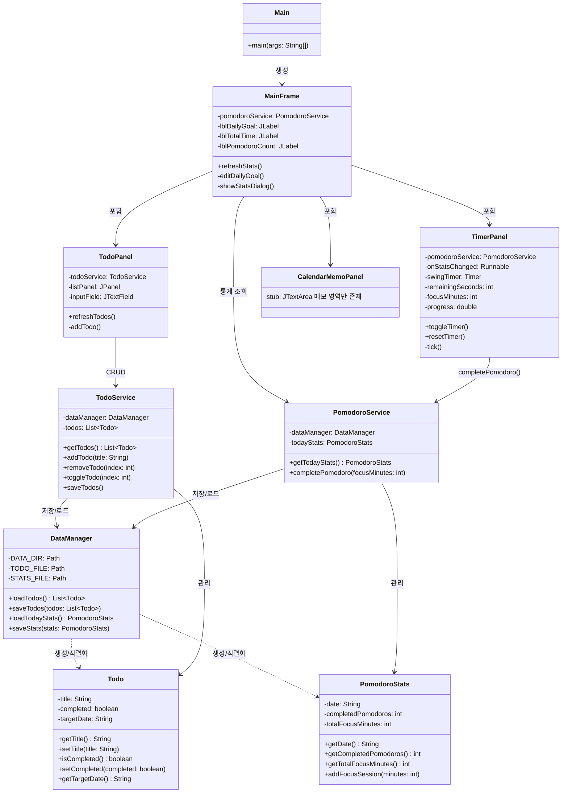

# 클래스 다이어그램 (Class Diagram)

> 노션에서 Mermaid가 렌더링 안 되면 아래 텍스트 다이어그램을 대신 사용하세요.

## Mermaid 다이어그램



---

## 텍스트 다이어그램 (노션 복붙용)

```
[Main]
  └─ creates ──► [MainFrame]
                    ├─ has ──► [TimerPanel] ──► [PomodoroService]
                    ├─ has ──► [TodoPanel]  ──► [TodoService]
                    ├─ has ──► [CalendarMemoPanel]  (stub)
                    └─ uses ─► [PomodoroService]
                                    │
                              [DataManager] ◄── [TodoService]
                                    │
                          저장: data/todo_list.txt
                               data/pomodoro_stats.txt

모델 계층:
[Todo]           title | completed | targetDate
[PomodoroStats]  date | completedPomodoros | totalFocusMinutes
```

---

## 타이머 완료 시퀀스

```
사용자            TimerPanel         PomodoroService        DataManager         MainFrame
  │                  │                     │                     │                  │
  │ PAUSE 클릭       │                     │                     │                  │
  │─────────────────►│                     │                     │                  │
  │                  │ tick() - 1초마다    │                     │                  │
  │                  │ remainingSeconds = 0 │                     │                  │
  │                  │─────────────────────►│                     │                  │
  │                  │     completePomodoro(focusMinutes)         │                  │
  │                  │                     │──────────────────────►│                  │
  │                  │                     │     saveStats(stats)  │                  │
  │                  │                     │◄──────────────────────│                  │
  │                  │◄────────────────────│                     │                  │
  │                  │ onStatsChanged.run() ──────────────────────────────────────►  │
  │                  │                     │                     │   refreshStats()  │
  │ "완료!" 다이얼로그│                     │                     │                  │
  │◄─────────────────│                     │                     │                  │
```

---

## 레이어 역할 요약

| 레이어 | 패키지 | 역할 |
|--------|--------|------|
| UI | `ui.*` | 화면 그리기, 사용자 입력 받기 |
| Service | `service.*` | 비즈니스 로직 (추가/삭제/완료/세션 기록) |
| Storage | `storage.*` | 파일 읽기/쓰기 |
| Model | `model.*` | 데이터 구조 정의 |
